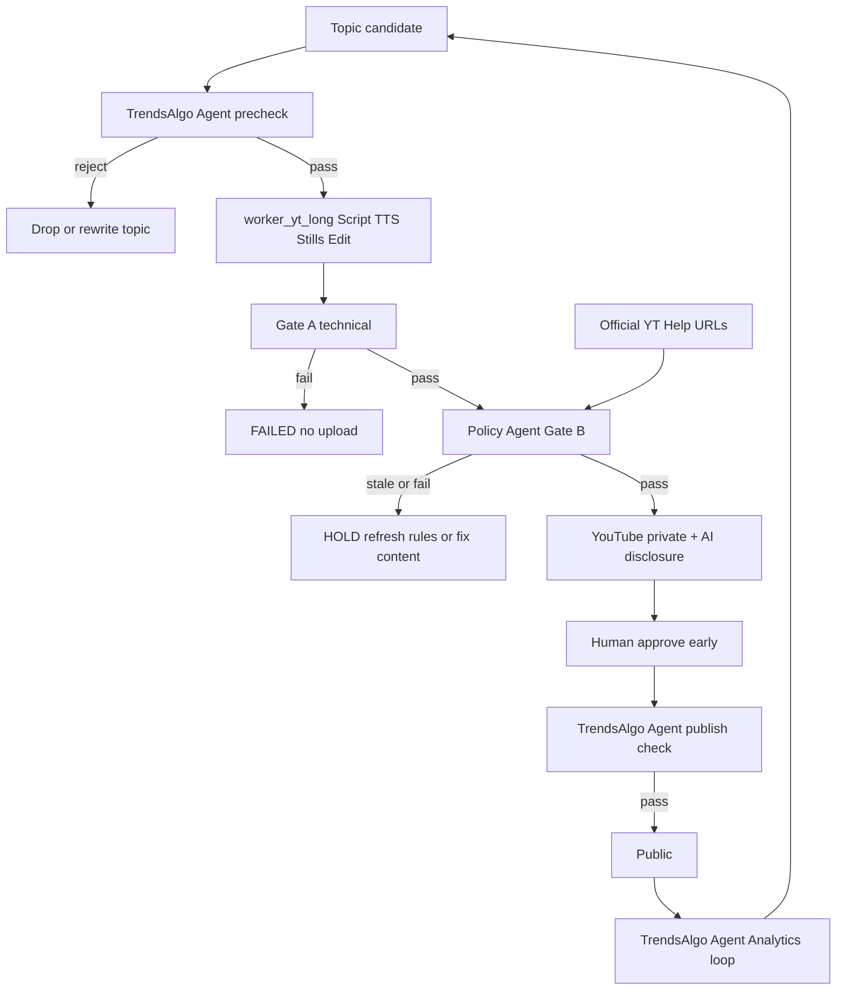

# Plan C — YouTube Long Video Factory

**Status:** Ready to execute in a **new, isolated project** (do not patch the old 9-model factory).  
**Owner:** Rayyan  
**Product:** One model only — YouTube long-form horizontal video.

---

## 1. Goal

Build a completely independent factory that:

1. Generates **~10 minute** YouTube videos at **1280×720 (16:9)**.
2. Uses **gallery-style pacing**: **one scene per sentence** (~**3 s** each → ~**200 scenes** per 10 min video).
3. Uses **AI image diffusion** stills (RunPod 4090 **images-only**) + **VPS FFmpeg Ken Burns**.
4. Runs in its **own Docker Compose stack**.
5. Blocks public publish unless **technical gates**, a **Policy Agent** (official YouTube Help), and a **Trends + Algo Agent** all pass.
6. Keeps cost low: **no RunPod TTS/compose**; Kokoro + FFmpeg on **VPS**; RunPod only if used for **stills**.

---

## 2. Decision locks (do not reopen during v1)

| Knob | Lock |
|------|------|
| Product | `YouTube_Long` only — no Shorts, Sleep Stories, KDP, podcasts, scrapers, growth daemons |
| Length | **~10 min** target (band 7–12 min at Gate A) |
| Pacing | **Gallery style** — **1 sentence = 1 scene**, target **~3 s/sentence** |
| Scenes / 10 min | **~200** (range **150 @ 4 s** … **300 @ 2 s**) |
| Cadence | **15 videos / month** planning default |
| Aspect | **1280×720** enforced by EditModule + ffprobe gate |
| Visuals | AI stills + Ken Burns; **AI video hooks OFF** by default; **sparse AI clips optional later** (see §7.1) |
| Edit | **VPS FFmpeg only** — no RunPod compose |
| Images GPU | **RunPod serverless 4090 images-only** (budget **~$3–6/mo** @ 15×10 min) **or** managed image API |
| Image parallelism | **Capped concurrent image workers OK** (speed only — does not cut $/still); VPS encode/TTS stays `max_jobs=1` |
| TTS | **Kokoro on VPS only** — never on RunPod |
| VPS SKU | Prefer **VPS-3** (6 vCore / 12 GB / 100 GB @ ~$12.32/mo); VPS-2 (4×8 GB) is tight for ~200 scene encodes |
| Orchestration | FastAPI + ARQ + Postgres + Redis + MinIO — **no n8n in pipeline** |
| Isolation | Hard — new project root, own ports/volumes/secrets/Dockerfiles |
| Publish | Private → human approve (first N) → public |
| Policy | Separate **Policy Agent** — official YouTube Help as source of truth |
| Trends | Separate **Trends + Algo Agent** — must pass before public |

---

## 3. Modules

### 3.1 Production pipeline

| # | Module | Responsibility |
|---|--------|----------------|
| 1 | **ScriptModule** | LLM script split into **sentence-level scenes** (~3 s each) for ~10 min |
| 2 | **VoiceModule** | Kokoro TTS on VPS — one short WAV per sentence/scene |
| 3 | **VisualModule** | One AI still per sentence (RunPod 4090 **or** managed API); light validate + retry ≤2; fail loud |
| 4 | **EditModule** | VPS FFmpeg: short Ken Burns per still, concat ~200 clips, hard **1280×720** |
| 5 | **PublishModule** | YouTube Data API — private first; AI disclosure fields; then public after gates |

### 3.2 Guard / intel agents (separate processes)

| # | Agent | Responsibility |
|---|-------|----------------|
| 6 | **Policy Agent** | Sync official YT Help pages → versioned rule pack → Gate B; **block public** if fail or rules stale |
| 7 | **Trends + Algo Agent** | Pre-topic trend fit; pre-public packaging check; post-public Analytics traffic-source loop |

### 3.3 Infra (required, not content)

- Postgres (jobs, events, policy snapshots, algo insights)
- Redis / ARQ (queue `YouTube_Long`, **VPS pipeline `max_jobs=1`** — do not parallel FFmpeg/TTS on one 8–12 GB box)
- Optional: **parallel image fan-out** inside a job (capped RunPod/API concurrency) for wall-clock only
- MinIO (script, audio, images, final.mp4, policy raw snapshots)
- FastAPI (`POST /v1/jobs`, health, approve-public)
- One VPS worker: `worker_yt_long` (encode/TTS serial); image sub-tasks may fan out remotely
- Optional light daemons: `policy_agent`, `trends_algo_agent`

### 3.4 Explicitly out of scope (v1)

- YouTube Shorts / 9:16
- Wikimedia, MET, CLIP, Chroma image search
- Full AI-video for entire runtime (Kling/Runway/SVD filling every second)
- RunPod TTS / RunPod FFmpeg compose (images-only allowed)
- Local Stable Diffusion on the VPS (OOM risk even on 12 GB when TTS+FFmpeg run)
- Airtable, Apify growth, TikTok/IG, Teachable, KDP, blogs
- n8n as orchestrator

---

## 3.5 Gallery pacing — scene math (locked practical pick)

**Rule:** every spoken sentence gets its own visual scene (gallery / “galular” style).

| Sentence duration | Scenes in a **10 min** (600 s) video | Stills / month @ **15 videos** |
|-------------------|--------------------------------------|--------------------------------|
| 2 s | 300 | 4,500 |
| **3 s (practical pick)** | **~200** | **~3,000** |
| 4 s | 150 | 2,250 |

**ScriptModule must:**

- Write narration as short sentences (~6–12 words) aiming **~3 s** TTS each.  
- Emit `scenes[]` with `index`, `text`, `visual_prompt` — **one row per sentence**.  
- Reject scripts whose sentence count falls outside **~150–300** for a ~10 min target (or re-split).

**EditModule must:** render and concat **N** short clips where N = sentence count (expect ~200). Use `max_jobs=1`, sequential scene encode, delete intermediates after MinIO final.

---

## 4. End-to-end flow

```text
topic_proposed
  → trends_precheck          (Trends + Algo Agent)
  → queued
  → scripting                (ScriptModule)
  → tts                      (VoiceModule)
  → visuals                  (VisualModule)
  → edit                     (EditModule — VPS FFmpeg)
  → gate_a_technical         (ffprobe, placeholders, cost, duration)
  → gate_b_policy            (Policy Agent + fresh snapshot)
  → uploaded_private         (+ AI / altered-content disclosure)
  → human_approved           (mandatory for first N videos)
  → trends_publish_check     (Trends + Algo Agent)
  → public
  → algo_feedback            (async Analytics loop)
```



---

## 5. Isolation / new project layout

**Recommended root:** `/home/ubuntu/yt_long_factory/` (or any new git repo).

**Compose project name:** `yt_long`  
**Do not** share containers, volumes, or networks with the old `youtube_automation` stack.

### Suggested host ports (avoid old factory defaults)

| Service | Host port |
|---------|-----------|
| API | **8100** |
| Postgres | **5433** |
| Redis | **6380** |
| MinIO API / console | **9100 / 9101** |

### Suggested tree

```text
yt_long_factory/
  PLAN_C.md                 # this document
  docker-compose.yml
  Dockerfile                # API
  Dockerfile.worker         # ffmpeg + kokoro + worker
  .env.example
  secrets/
    client_secret.json
    youtube_token.json
  config/
    policy_sources.json
    niche_allowlist.json
    style_prompt.txt
  src/
    api/
    domain/
    db/
    workers/
      pipeline.py
      stages/
    services/
      script.py
      tts_kokoro.py
      visuals_ai.py
      composer.py           # EditModule — VPS FFmpeg only
      youtube.py
      policy_agent/
      trends_algo_agent/
      gates.py
      cost_guard.py
  tests/
```

**Delete-old-safe rule:** stopping/removing the legacy factory must not stop `yt_long`.

---

## 6. EditModule contract (locked)

```text
inputs:  scene_i.jpg + scene_i.wav  (+ optional scene_i_clip.mp4 later)
process: per-scene Ken Burns (zoompan) @ 1280x720 → scene_i.mp4
         ffmpeg concat → final.mp4
         optional loudness normalize (~-14 LUFS)
output:  final.mp4 — ffprobe width=1280 height=720 + audio stream
refuse:  missing still, wrong aspect, known placeholder/gradient
backend: COMPOSE_BACKEND=vps_ffmpeg only (no RunPod value in v1)
```

**Practicality:** 9.0 / 10 for this product (CPU Ken Burns; ~$0 marginal; debuggable on VPS).

**Gallery note:** ~200 short Ken Burns clips is CPU-heavy — prefer **VPS-3 (12 GB)**; always `max_jobs=1`; `veryfast` preset; prune scene MP4s after concat.

**Quality tips (cheap):** mild zoom only (scenes are 2–4 s), soft crossfades optional, alternate pan direction by scene index.

---

## 7. VisualModule (gallery stills)

| Rule | Value |
|------|--------|
| Density | **1 still per sentence** (~200 / 10 min video) |
| Primary path | **RunPod serverless RTX 4090 — images only** (SD/Flux worker); download JPG to VPS |
| Alternate path | Managed image API (WaveSpeed / OpenRouter) if RunPod credits empty |
| Style | Fixed channel style lock (`config/style_prompt.txt`) — gallery / cinematic still |
| Resolution | Generate **1280×720** (no 4K) |
| Validation | Cheap local checks first; vision LLM **only on rejects / sample**, not full 200× paid judge every time |
| Retries | **max 2** per scene still |
| Failure | Job **FAILED** — never upload gradients |
| AI video hooks | `ENABLE_AI_VIDEO_CLIPS=false` |
| Checkpoint | Resume mid-job; do not regenerate completed scene stills |
| Never on RunPod | TTS, FFmpeg concat, Policy/Trends |

**Do not use in v1:** Wikimedia / MET / CLIP as main visual path; local SD on VPS.

### RunPod images-only monthly budget (locked estimate)

Rate band ~**$0.00031/s** (~$1.10/hr) serverless 4090. ~2–5 s GPU per still + cold start/retry overhead.

| | Per **10 min** video (~200 stills) | **15 videos / month** |
|--|------------------------------------|------------------------|
| GPU time (typical) | ~8–20 min | — |
| **RunPod $** | **~$0.15–0.37** | **~$2.25–5.55 ≈ budget $3–6/mo** |
| Pessimistic (slower steps) | ~$0.50 | ~$7.50 |

**$15 RunPod credits** at this profile ≈ **~2–6 months** of image-only use for 15×10 min/mo (depends on steps/retries).

VPS still pays for: TTS + FFmpeg + DB (VPS-3 rent ~$12.32/mo) + LLM tokens separately.

### 7.1 Amendment note — parallel image workers + sparse AI clips (cost, not v1 default)

**Decision (soft lock):**
- **Parallel image workers:** allowed with a hard concurrency cap (e.g. 4–8). Speeds gallery stills; **$/still unchanged**.
- **VPS encode + Kokoro:** stay **serial** (`max_jobs=1`) on one VPS.
- **Sparse AI video clips:** optional later behind `ENABLE_AI_VIDEO_CLIPS`; default **off**. Use for hook / climax / closer only — **not** a cost saver.
- Prefer **image-to-video from the scene still** (I2V) so style stays locked; trim/pad in EditModule to sentence duration (~3 s).

**Planning sparse profile (locked for estimates):** **5 clips × ~5 s** per 10 min video (= **25 s** AI motion ≈ **4%** of runtime). Cadence **15 videos/mo** → **75 clips/mo** → **375 AI-video seconds/mo**. Stills budget (~200×15) **stays** (~$3–6/mo); sparse video is **additive** (I2V still needs the JPG).

| Path (720p-ish, ~5 s clip) | $/clip (approx) | **+/video** (5 clips) | **+/month @ 15** | Visuals total (stills $3–6 + video) |
|----------------------------|-----------------|------------------------|------------------|--------------------------------------|
| Cheap aggregator / Pruna-class (~$0.02/s) | ~$0.10 | ~$0.50 | **~$7.50** | **~$11–14/mo** |
| RunPod WAN 2.2 I2V (~$0.30 / 5 s) — **preferred planning pick** | ~$0.30 | ~$1.50 | **~$22.50** | **~$26–29/mo** |
| Kling API turbo band (~$0.084–0.112/s) | ~$0.42–0.56 | ~$2.10–2.80 | **~$32–42** | **~$35–48/mo** |
| Kling / WAN premium band (~$0.14–0.15/s or 1080p) | ~$0.70–0.75 | ~$3.50–3.75 | **~$53–56** | **~$56–62/mo** |

**Vs images-only $3–6/mo:** sparse mid path (**WAN 2.2**) adds about **+$23/mo** → visuals jump from **~$4** to **~$28** (roughly **~5–7×** the image line alone). Cheap path adds **~+$8/mo**; premium can add **~+$50+/mo**.

| Sparse intensity | Clips / video | AI-video s / mo @ 15 | WAN 2.2 add-on $/mo | Notes |
|------------------|---------------|----------------------|---------------------|--------|
| Minimal | 3 × 5 s | 225 s | **~$13.50** | hook + 1 turn + closer |
| **Default sparse** | **5 × 5 s** | **375 s** | **~$22.50** | planning default |
| Heavy sparse | 8 × 5 s | 600 s | **~$36** | still ≪ full AI runtime |
| Full AI runtime (out of scope) | ~120 × 5 s | ~9,000 s | **~$500+** | do not build in v1 |

**Cost guards to add when enabling clips:** `MAX_AI_VIDEO_CLIPS_PER_JOB=5`, `MAX_AI_VIDEO_SECONDS_PER_JOB=25`, `MAX_AI_VIDEO_USD_PER_JOB` (e.g. **2.00**), keep `MAX_COST_USD_PER_JOB` inclusive of stills+video+LLM.

---

## 8. Cost guards

| Guard | Example |
|-------|---------|
| `MAX_COST_USD_PER_JOB` | e.g. **2.00** (200 stills + LLM headroom) |
| `MAX_COST_USD_PER_DAY` | e.g. 5.00 — pause queue when hit |
| `MAX_RUNPOD_SECONDS_PER_JOB` | Cap image GPU seconds (fail or fallback to API) |
| `max_jobs` | **1** (mandatory on 8–12 GB with ~200 encodes) |
| Scene budget | **~150–300** stills; target **~200** |
| Disk | Delete `scene_*.jpg/wav/mp4` after final in MinIO + YouTube OK |
| Old factory | Stop legacy workers while building (free RAM) |

### Monthly all-in sketch (15 × 10 min gallery, planning ±40%)

| Line | Approx |
|------|--------|
| VPS-3 rent | **~$12.32** |
| RunPod images-only | **~$3–6** |
| LLM (script + light judges) | **~$3–6** (more scene prompts than old 12–18 scene plan) |
| YouTube | $0 |
| **Ballpark total (stills-only visuals)** | **~$18–25 / month** |
| Optional sparse AI clips (5×5 s, WAN 2.2) | **+$22.50** → ballpark **~$41–48 / month** |
| Optional sparse cheap path (~$0.02/s) | **+$7.50** → ballpark **~$26–33 / month** |

Full AI-video filling 10 min runtime is **not** Plan C — deferred. Sparse clips only behind flag + hard caps (§7.1).

---

## 9. Gate A — technical (auto-fail)

| Check | Rule |
|-------|------|
| Aspect | Exactly **1280×720** |
| Streams | Video **and** audio present |
| Duration | Band e.g. **7–12 min** |
| Placeholders | No gradient / solid-color frames |
| Coverage | Still count == **sentence/scene count** (expect ~150–300; target ~200) |
| Scene length | Median scene audio ~**2–4 s** (gallery pacing) |
| Vision | Every still ≥ threshold after ≤2 retries |
| Cost | ≤ `MAX_COST_USD_PER_JOB` |
| File | Final in MinIO; size above minimum (reject mocks) |

---

## 10. Policy Agent

### Source of truth (official only)

Config: `config/policy_sources.json` — fetch and snapshot:

- [Community Guidelines](https://www.youtube.com/howyoutubeworks/policies/community-guidelines/)
- [Spam / deceptive practices](https://support.google.com/youtube/answer/2801973)
- [Reused / repetitious content (YPP)](https://support.google.com/youtube/answer/1311392)
- [Misinformation / manipulated media](https://support.google.com/youtube/answer/10835034)
- [Disclosing GenAI / altered content](https://support.google.com/youtube/answer/14328491)
- [YouTube Terms of Service](https://www.youtube.com/static?template=terms)
- [How YouTube Works](https://www.youtube.com/howyoutubeworks/) (monetization / advertiser-friendly links)

Store: `content_hash`, `fetched_at`, raw snapshot (MinIO), compiled rule pack (Postgres `policy_snapshots`).

### Refresh → adapt

1. Cron every **6–12 h** and on every pre-publish refetch.  
2. Hash change → bump `policy_version`, recompile structured checks (LLM quote-constrained).  
3. Jobs awaiting public must re-run Gate B on the new snapshot.  
4. Compile failure → **HOLD all publics** + alert (fail closed).  

### Seed Gate B rules

| Rule ID | Check |
|---------|--------|
| `ai_disclosure` | YouTube AI/altered-content attribute + description footer: “Visuals and narration in this video are AI-assisted. The script is original and human-written. Altered or synthetic media is disclosed per YouTube guidelines.” (shared by napstorian + napping_historian) |
| `no_real_person_abuse` | Ban non-consensual deepfakes / deceptive celebrity impersonation |
| `no_misleading_thumb_title` | Title/thumb match script promise |
| `originality` | Script not near-duplicate of last N jobs |
| `topic_allowlist` | Niche allowlist only |
| `music_license` | Configured BGM pack or silence |
| `made_for_kids` | Correct `selfDeclaredMadeForKids` |
| `spam_cadence` | Max publishes/day |
| `advertiser_friendly` | Borderline → human hold |

**Block public if** policy snapshot older than `MAX_POLICY_AGE_HOURS` **or** any hard rule fails.

---

## 11. Trends + Algo Agent

YouTube has **no API named “the algorithm.”** Use **traffic sources** from YouTube Analytics:

- Browse, Suggested, Search, External, Notifications, Other  

### Pre-publish (required)

1. Trend fit for niche (Data API search/related; optional niche Reddit — not spam farms).  
2. Saturation: too many near-identical titles this week → rewrite or drop.  
3. Packaging matches **this channel’s** recent winners (from algo loop).  
4. Policy allowlist cross-check (viral ≠ allowed).  

### Post-publish loop (24–72 h+)

Track impressions by source, CTR, AVD / retained %, subs/video → write `algo_insights` → bias next topics/titles. Suspend weak patterns for 7 days.

---

## 12. Channel / content fit (AI stills)

Prefer niches where style continuity beats photo realism:

1. Gallery / museum-style history essays  
2. What-if history  
3. Myth & folklore  
4. Dark-academia explainers  

Avoid: news, real private-person likeness abuse, copyrighted music rips, mass duplicate uploads.

---

## 13. Resources checklist

### Always-on (new stack)

Postgres, Redis, MinIO, API, `worker_yt_long`, Policy Agent, Trends+Algo Agent  

### External APIs

| Resource | Required |
|----------|----------|
| LLM (WaveSpeed / OpenRouter) | Yes — script + light judges |
| **RunPod 4090 serverless** | **Optional but preferred for stills** — **images only** |
| Managed image API | Fallback if RunPod off / credits empty |
| YouTube Data API OAuth | Yes — upload |
| YouTube Analytics API | Yes — algo loop (after channel has data) |
| AI video API | No for v1 |
| RunPod for TTS/FFmpeg | **No** |

### Secrets

```text
secrets/client_secret.json
secrets/youtube_token.json
.env → POSTGRES_*, REDIS_URL, S3_*, LLM keys, API_KEY,
       RUNPOD_API_KEY, RUNPOD_ENDPOINT_ID (image worker),
       IMAGE_BACKEND=runpod|api,
       MAX_COST_USD_PER_JOB, MAX_COST_USD_PER_DAY, MAX_RUNPOD_SECONDS_PER_JOB,
       MAX_POLICY_AGE_HOURS, TARGET_SECONDS_PER_SCENE=3,
       ENABLE_AI_VIDEO_CLIPS=false, COMPOSE_BACKEND=vps_ffmpeg
```

---

## 14. Implementation schedule (~28:45 active + buffer)

| Phase | Hours:Minutes | Exit criteria |
|-------|---------------|---------------|
| Planning lock | 0:45 | This doc agreed |
| Scaffold isolation | 3:00 | `:8100/health` green; old stack unused |
| Script + TTS + stills + vision + FFmpeg | 6:30 | One local `final.mp4` 1280×720 |
| Cost guards + checkpoints | 2:00 | Caps + resume work |
| Gate A + private YouTube + AI disclosure | 2:30 | Private watch URL |
| Policy Agent | 5:00 | Gate B fail-closed works |
| Trends + Algo Agent | 6:00 | Precheck + Analytics stub/loop |
| Soak + runbook | 3:00 | 2 privates + 1 gated public |
| **Total** | **~28:45** | |
| Risk buffer | +5:00–8:00 | |
| Optional AI-video hooks later | +4:00–5:30 | Behind both agents |

Calendar feel: **~4 focused days** to first policy-gated public (human still in loop).

---

## 15. Verification

1. `curl http://localhost:8100/health` → OK with only `yt_long` containers up.  
2. Enqueue `business_model=YouTube_Long` topic → job completes stages.  
3. `ffprobe final.mp4` → 1280×720, has audio.  
4. Force bad still / over-budget → job **FAILED**, no upload.  
5. Stale policy snapshot → public blocked.  
6. Trends precheck reject → no queue burn.  
7. Private upload visible in YouTube Studio; AI disclosure set.  
8. Stop/remove old factory → `yt_long` still healthy.  

---

## 16. What we will NOT do

- Put n8n in charge of FFmpeg / TTS / policy  
- Trust unofficial “algorithm 2026” blogs as policy authority  
- Auto-public without fresh policy snapshot  
- Chase unrelated viral trends that break niche or Community Guidelines  
- Claim perfect future-policy compliance without fail-closed + human hold  
- Share DB/Redis/MinIO with the old factory if delete-old-safe is a hard requirement  

---

## 17. Execute trigger (for the coding agent)

When ready to build in the **new** project, say:

**`Suggested C + Policy/Trends agents — execute`**

Optional knobs to state once: policy refresh hours (6 vs 12), human-approve count (e.g. first 5), niche allowlist, Analytics delay (24 vs 72 h), daily $ cap.

---

## 18. One-line summary

**Isolated YouTube Long factory: gallery pacing (~3 s/sentence → ~200 stills per 10 min), RunPod images-only (~$3–6/mo @ 15 videos), VPS Kokoro + FFmpeg Ken Burns at 1280×720, no RunPod compose, Policy + Trends agents before public**
