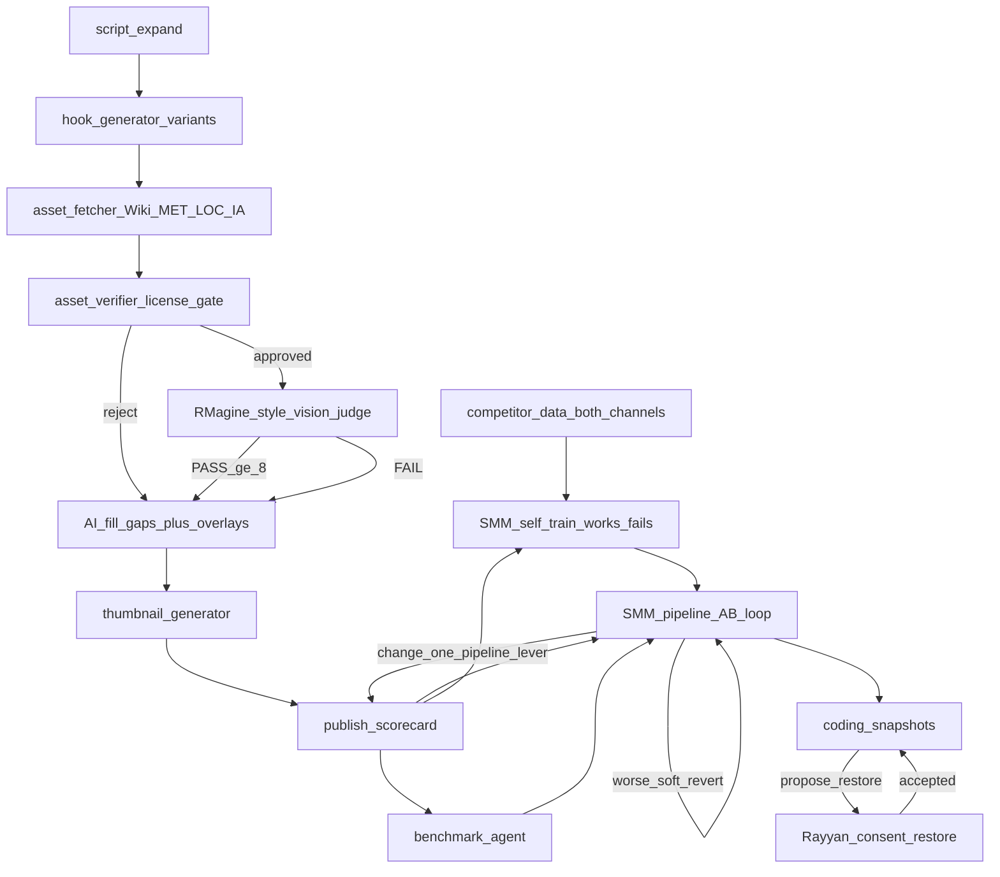

# Autonomous assets + hook + SMM A/B revert (brainstorm)

## What we were NOT doing (before this brainstorm) → what we WILL implement

- **No shared pre-ingest license gate** — we relied on curated PD / Met OA paths without a single `verify_asset()` rules check on every candidate. → Implement farm-safe [`asset_verifier.py`](src/services/asset_verifier.py) (domain + license; reject NC/ND/fair-use; digitization trap = reject → AI fill; no Pexels/Pixabay/Unsplash as PD).
- **No multi-source keyword search + stage** — no Wiki/Archive/LOC/Met `search_and_stage` that downloads, writes license sidecars, and routes approved vs reject. → Implement [`asset_fetcher.py`](src/services/asset_fetcher.py) wired into the visuals ladder.
- **No headless vision bouncer in the farm** — RMagine’s Wiki/MET + vision≥8 lived in the Studio prototype, not in production compose. → Port headless vision judge after verify; FAIL → next candidate → AI still fill.
- **No Netflix-doc few-shot hook engine** — we had [`hook_cold_open.txt`](config/prompts/hook_cold_open.txt) / CEO prompt patches, not multi-variant generation with banned-phrase filter, pattern labels, and reject logs. → Implement [`hook_generator.py`](src/services/hook_generator.py) at script stage + `hook_rejects.jsonl` / pattern learning from scorecard.
- **No human image review queue (and we will keep it that way)** — we were not systematically auto-filling when PD candidates fail; Claude’s docs assume `manual_review`. → Auto-reject digitization/weak assets → AI fill; `needs_review/` is dead-letter analytics only, not a Rayyan blocker.
- **No measure → revert → next-lever SMM loop** — CEO/SMM can soft-package, patch prompts, trial voice, heal SOP, but does not snapshot baselines, auto-revert failed changes, or advance one lever at a time. → Whole-pipeline experiment ledger (`smm_experiments.jsonl`): change one lever → measure → if worse revert → try next.
- **No durable works/fails memory / self-training** — competitor refresh + $0 playbook exist, but SMM does not rank “what works / what doesn’t” across the full production stack or feed that into the next experiment. → Self-train from **both channels’ competitor data** (primary) + our scorecard outcomes into `smm_works.jsonl` / `smm_fails.jsonl` / ranked playbook.
- **No coding-change snapshots with consent restore** — continuous prompt/SOP/code/config updates have no restore trail; if an older revision worked better, SMM cannot propose rolling back. → Snapshot every agent-driven coding/config change; if metrics drop, **report proposed restore in digest**; apply only after **Rayyan consent**.
- **No multi-variant thumbnail factory** — titles/thumbs are patched ad hoc; no ffmpeg candidate frames + composited A/B variants logged to CTR. → Implement [`thumbnail_generator.py`](src/services/thumbnail_generator.py) from [`thumbnail.md`](thumbnail.md); log `thumbnail_log.jsonl`; feed winners into SMM works memory.
- **No post-upload niche benchmark / anomaly diagnosis** — scorecards exist, but no median day-1/3/7/14 curves by niche_tag, no content-vs-distribution checklist, no test-channel recommendation protocol. → Implement [`benchmark_agent.py`](src/services/benchmark_agent.py) from [`benchmarksagent.md`](benchmarksagent.md); skeptical of “shadowban”; escalate only on impressions/traffic-source signature.
- **No attribution artifact for BY/SA stills used in a job** — → Write per-job attribution file when CC BY/SA assets are used.
- **No automated hook-pattern ranking from live metrics** — → Feed CTR / first-60s back into which `pattern_used` ranks first per channel.

## Locked defaults (from your full-trust CEO stance)

- **No human image babysitting:** Claude’s `manual_review` becomes **auto-reject → AI fill**, not a Rayyan queue.
- **Monetization-safe only:** keep Met Open Access + Wikimedia PD/CC0/BY (with credit) + LOC/Archive when license proves PD. **Do not** treat Pexels/Pixabay/Unsplash as PD (Claude’s whitelist is too loose for your farm).
- **One lever at a time** for whole-pipeline A/B; always **revert** soft levers before the next change if the post-change window underperforms the pre-change baseline.
- **Competitor data is the primary training source** for both napstorian and napping_historian ([`config/competitors.json`](config/competitors.json), [`config/competitors_napping_historian.json`](config/competitors_napping_historian.json), refresh metrics under `output/ops/competitors_*`); our own scorecards are the outcome label, not the idea source.
- **Keep two Brand channels, not five mirrors:** do **not** spin up 5 channels posting the same video for a 1-week keep/kill. See advice section — learning happens via in-channel packaging A/B + competitor training + optional **one** disposable test channel for distribution isolation (Rayyan consent).
- **Thumbnail + benchmark are first-class SMM sensors:** thumb variants and niche benchmarks feed `smm_works` / `smm_fails`; diagnosis must rule out CTR/retention/timing before blaming the algorithm.
- **Coding restore requires Rayyan consent:** soft packaging / schedule / voice trials may auto-revert; **code, prompt files, and SOP structural patches** are snapshotted and only restored after you accept the digest proposal.



---

## What the Claude docs give you (now five)

| Doc | Job | Gap vs autonomy today |
|-----|-----|------------------------|
| [`assest-fetcher.md`](assest-fetcher.md) | Search Wiki / Archive / LOC / Met(+Rijks/SI TODOs), normalize + download + sidecar JSON | Farm has curated [`pd_clippings.py`](src/services/pd_clippings.py) + Met OA; not full multi-source `search_and_stage` |
| [`assest_verification.md`](assest_verification.md) | Domain whitelist + license tags + digitization flag + footage audio-strip | Partial license sidecars exist; no shared `verify_asset()` pre-ingest gate; Claude whitelist includes Pexels etc. (reject for farm) |
| [`hook_generator.md`](hook_generator.md) | Netflix-doc few-shot hooks + banned-phrase filter + pattern labels | You have [`config/prompts/hook_cold_open.txt`](config/prompts/hook_cold_open.txt) + CEO prompt patches; not a dedicated multi-variant generator with reject logs / pattern learning |
| [`thumbnail.md`](thumbnail.md) | ffmpeg scene/hook frames → face/contrast score → Pillow vignette/text composites → N diverse A/B variants + `thumbnail_log.jsonl` | CEO can patch `thumbnail_template.txt`; no frame extraction factory or CTR-logged variant ledger wired to SMM works |
| [`benchmarksagent.md`](benchmarksagent.md) | Niche median day-1/3/7/14 projections; daily actual vs projected; content-first then distribution diagnosis; recommend (not auto) secondary test-channel validation | Scorecards + goals exist; no niche_tag curves, no consecutive underperformance diagnosis, no structured test-channel protocol |

## What RMagine ([`/home/ubuntu/Ai_studio_prototyping`](/home/ubuntu/Ai_studio_prototyping)) adds

Steal the **brain**, not the Studio UI:

- 4-phase Wiki+MET waterfall + `visionLlmJudge` / `validateImageWithVisionLlm` (PASS only if confidence ≥ 8)
- Query distillation for Tudor artifacts / figures
- Concurrent candidate fetch

Drop / replace for farm:

- Browser IndexedDB + “please review and refine”
- Pexels-first paths
- Human manual search / per-image approve

---

## Target architecture (autonomous)

### A. Production media ladder (per scene)

1. **Hook layer (script stage):** `hook_generator.generate_hooks()` → pick best variant by channel rules (napstorian: title-promise + counterfactual; historian: mystery/withheld identity). Write into cold open / chapter 1; log patterns to `hook_rejects.jsonl` / later `hook_ratings` from SMM CTR/first-60s.
2. **Fetch:** `asset_fetcher.search_and_stage(keyword from scene)` across Wiki + Met OA (+ LOC/IA when license OK).
3. **Verify (rules, no AI):** domain + normalized license ∈ `{public domain, cc0, cc-by}` (+ BY-SA only if attribution stamped). Digitization “restored/remastered” → **reject for auto** (safer than Claude’s manual_review). Footage → always `requires_audio_strip`.
4. **Vision (RMagine port, headless):** judge top-3 approved candidates vs scene text / historical figure. PASS≥8 → use; else next; else **AI still (Seedream/Flux)**.
5. **Compose:** PD heroes 8–15 + PD motion 4–6 (napstorian) + AI fill + overlays/SFX (existing premium path).
6. **Thumbnails (post-cut, pre-publish):** `thumbnail_generator.generate_thumbnails()` from cut + hook short texts → 3 diverse variants → pick via competitor-inspired rules / prior `smm_works` → log `thumbnail_log.jsonl`; CTR later via Reporting/`record_ctr_result`.
7. **Benchmark (post-upload):** `benchmark_agent.set_benchmark()` by niche_tag → daily `check_performance` → diagnose only after 2+ underperforming days → content checks before distribution → optional test-channel **recommendation** (Rayyan decides).

Asset/fetch/verify/vision/compose stay **zero Rayyan clicks**. Packaging coding restores and test-channel creation stay **consent**.

### B. Where it plugs into the farm

- After expand/script → hook generator (feeds [`hook_cold_open`](config/prompts/hook_cold_open.txt) application / scene 0 rewrite).
- During visuals → replace/augment curated PD with fetcher+verifier+vision before Flux fill ([`pd_clippings.py`](src/services/pd_clippings.py) + visuals module).
- Pre-ingest library optional: `output/assets/approved/` + `needs_review/` (review folder = dead-letter for analytics, not a human blocker).

### C. Channel split

- **Napstorian:** denser PD motion + punchier hook patterns (ticking_clock / false_assumption).
- **Historian:** calmer hooks (identity_withheld / mystery); fewer/no motion; softer stills.

---

## SMM: whole-pipeline A/B + self-train + coding restore (consent)

Today SMM can soft-package, patch prompts, trial voice, heal SOP, and pull competitor hours — but it does **not** systematically A/B the production stack, keep a durable works/fails memory, or snapshot coding for consent-based restore. That is what we add.

### Primary training source: competitors (both channels)

| Channel | Config | Metrics / refresh |
|---------|--------|-------------------|
| napstorian | [`config/competitors.json`](config/competitors.json) | `output/ops/competitors_metrics_last.json`, `competitors_refresh_last.json` |
| napping_historian | [`config/competitors_napping_historian.json`](config/competitors_napping_historian.json) | `output/ops/competitors_metrics_last_napping_historian.json`, `competitors_refresh_last_napping_historian.json` |

Each CEO/SMM beat:

1. Refresh competitor uploads/hours/titles/thumb patterns (existing [`CompetitorsAgent`](src/agents/competitors_agent.py) + CEO refresh).
2. Distill hypotheses into candidate pipeline levers (hook pattern, title shape, thumb focal subject, length band, chapter density, upload hour, pacing — **not** copying their footage).
3. Label our own videos with scorecard outcomes (CTR when Reporting ready; else views velocity + AVD% + first-60s).
4. Write/update **self-train memory** (below). Competitor signals propose *what to try*; our metrics decide *what worked*.

### Self-train memory (SMM teaches itself)

Artifacts under `output/ops/`:

- `smm_works.jsonl` — lever + evidence + channel + competitor cue that inspired it + metric delta (keep / promote).
- `smm_fails.jsonl` — same shape for failures (do not retry soon; cool-down).
- `smm_pipeline_playbook.md` — ranked “best known” settings per channel, regenerated from works/fails (replaces one-shot `$0` append-only noise over time).
- `smm_experiments.jsonl` — live experiment ledger (one open experiment per video).

Record shape:

```text
{id, channel, video_id_or_job, stage, lever, competitor_source, before_metrics, after_metrics,
 outcome: works|fails|inconclusive, baseline_snapshot, coding_snapshot_id?, applied_at, evaluated_at}
```

Digest always includes: top works, recent fails, next recommended lever, and any pending coding restores awaiting consent.

### Whole-pipeline lever order (production stack, not packaging-only)

One live experiment per video/job. Soft levers auto-revert on worse; hard levers only propose.

1. Soft packaging (title/thumb/desc) — CTR
2. Publish hour (competitor schedule — already CEO)
3. Hook pattern / cold-open rewrite (`hook_generator`)
4. Thumbnail-only refresh
5. Outline / pacing / chapter density (prompt or next-job SOP)
6. PD vs AI visual mix / vision threshold / overlay-SFX density
7. Voice trial — late; soft-revert immediately if AVD/first-60s drop
8. Length / structure prompt band (future jobs; no Gate-R hard length HOLD)
9. **Coding / module / structural SOP patch** — always via coding snapshot + **Rayyan consent** to keep or restore

Rule: **never stack two live experiments on one video**. Closing (lock or revert) frees the slot. Prefer competitor-inspired levers that already appear in `smm_works` for that channel.

### Coding change snapshots (continuous updates → restore with consent)

Whenever SMM/CEO (or this pipeline work) changes **code, prompts, or structural SOP**:

1. Write a snapshot under `output/ops/smm_code_snapshots/<id>/` (file paths + before/after blobs or git tree hash + message).
2. Append `smm_code_changelog.jsonl`: `{id, paths, reason, competitor_cue?, linked_experiment_id?, created_at}`.
3. After evaluation window: if linked metrics are **worse than pre-change baseline**, SMM does **not** silently `git checkout`. It:
   - Marks snapshot `proposed_restore`
   - Puts a clear block in `ceo_smm_digest.md` / email: what broke, what worked before, exact restore command/paths
   - Waits for **Rayyan accept / reject** (consent flag file or reply convention already used for digests)
4. On accept → restore snapshot, log `restored_with_consent`, append to `smm_works` that prior revision wins.
5. On reject → mark `restore_declined`, keep current code, cool-down that lever.

Soft packaging metadata reverts stay automatic (no consent). Code/prompt/SOP structural restores always need consent.

### Evaluation window

- Reporting CTR when available; else views velocity + AVD% + first-60s (existing fallback; never invent CTR).
- Compare to **same-video / same-job pre-change snapshot**; soft-check vs channel winner median and competitor peer band when present.
- **Improved** if primary rises without secondary cratering (e.g. CTR up and AVD not down >X%).
- **Worse soft lever** → auto-revert → `smm_fails` → next lever.
- **Worse coding lever** → propose restore → digest → consent.

### Pseudocode

```text
cues = distill(competitors[napstorian], competitors[napping_historian])
memory = load(smm_works, smm_fails)
baseline = snapshot(video_or_job)
for lever in rank_pipeline_levers(cues, memory, channel):
  if lever.is_coding:
    snap = snapshot_coding(paths); apply(lever)
  else:
    apply(lever)
  wait evaluation_window
  if better(baseline):
    record_works(lever, cues); lock; refresh playbook; stop
  else if lever.is_coding:
    propose_restore(snap); digest_ask_Rayyan; stop_or_wait
  else:
    revert(lever); record_fails(lever); continue
if all fail: digest "format risk"; do not thrash
```

Wire into [`ceo_smm.py`](src/agents/ceo_smm.py) / [`smm_agent.py`](src/agents/smm_agent.py) scan beat + scorecard + existing competitor refresh.

---

## Advice: “5 channels, same content, 1 week, keep the winner” — don’t

Senior instinct (isolate what works fast) is right; the **5 identical-content mirrors** design is the wrong instrument for YouTube.

### Why it fails for this farm

- **Confounded experiment:** five cold channels ≠ five clean A/B arms. Age, subs, session history, and trust score dominate early views — you won’t know if the winner was the *format* or luck/timing.
- **One week is too short** for longform niche docs: day-7 medians are noisy at zero audience; you need niche baselines (benchmark agent) not a deathmatch between empty shells.
- **Same video × N channels** risks spam / reuse / multi-channel identical-content signals; can hurt *all* properties and muddy Content ID / monetization later.
- **Splits your scarce GPU + auth + attention** across five brands while napstorian + napping_historian already need distinct SOPs (punchy What-If vs sleep/doc).
- **Doesn’t isolate the lever:** identical masters only test *channel luck*, not hook/thumb/title/pacing — the levers that actually move CTR and AVD.

### What to do instead (locked recommendation)

1. **Keep the two Brand channels** and run **in-channel** whole-pipeline A/B (one lever at a time) trained on **competitor data**.
2. **Native packaging diversity:** `thumbnail_generator` + title/hook variants on the *same* upload path; log CTR; promote winners into `smm_works`.
3. **Optional single test channel (consent only):** only when `benchmark_agent` verdict is `likely_distribution_suppression` — upload a *new* same-tier piece (not the identical file) to one disposable test channel, as [`benchmarksagent.md`](benchmarksagent.md) specifies. Compare impressions/browse%, not vibes.
4. **Champion–challenger over time:** next video challenges the current playbook setting; losers go to `smm_fails` with cool-down — same learning goal as “keep/kill,” without five mirrors.
5. If you ever want multi-arm learning at scale, prefer **sequential variants on one growing channel** or Studio’s own title/thumbnail experiments when available — not parallel identical dumps.

### When a second/test channel *is* justified

- Suspected channel-specific distribution issue after content metrics look healthy (impressions down, CTR/AVD fine).
- Soft launch of a *new niche* you refuse to contaminate Brand with — different content, not a mirror of Brand masters.
- Never: five clones of the same master for a week-long popularity contest.

---

## Thumbnail agent (from [`thumbnail.md`](thumbnail.md))

Wire after cut exists + hook texts ready; before publish packaging lock.

- Stage A: ffmpeg scene detect + hook-timestamp frames; face/contrast/blur heuristics.
- Stage B: Pillow vignette, contrast, 3–5 word overlay (Anton/Bebas), face-aware placement.
- Stage C: pick `num_variants` (default 3) for **diversity** (frame × text × grade), not random duplicates.
- Log `thumbnail_log.jsonl`; `record_ctr_result` from Reporting CTR / scorecard when ready.
- If thumb uses external art → pass `asset_verifier` first.
- SMM lever “thumbnail-only refresh” consumes this module; winners update playbook per channel (napstorian punchier yellow/white; historian softer copy).

---

## Benchmark agent (from [`benchmarksagent.md`](benchmarksagent.md))

Daily cron alongside CEO beat / scorecard:

1. `set_benchmark(video_id, channel, historical_data)` — last 5–10 same `niche_tag`, **median** day1/3/7/14, sub-ratio scale → `benchmarks.jsonl`.
2. `check_performance` → on_track / under / over (±20%) → `performance_log.jsonl`.
3. After **2+ consecutive under days** → `diagnose_underperformance`:
   - Content first: CTR, AVD, upload slot vs best hours.
   - Distribution only if content OK: impressions vs channel norm; browse/suggested % drop.
   - Verdict: `likely_content_issue` | `likely_distribution_suppression` | `inconclusive_needs_more_data` — never “shadowban” from vibes.
4. `flag_for_test_channel_validation` → **recommend only** (Rayyan consent); log `test_channel_validation.jsonl`.
5. Feed verdicts into SMM: content_issue → open packaging/hook/thumb lever; distribution → pause lever thrash + digest alert; overperforming → lock settings into `smm_works`.

Skeptical default: most “algorithm suppression” is bad thumb/hook/timing — match the Claude note and your CTR/Reporting reality.

---

## More brainstorming ideas (parked → promote via SMM works)

These are **hypotheses**, not all build-now. SMM ranks them from competitor cues + outcomes:

1. **Title × thumb joint variants** — never change both blindly on a live winner; pair in generator, A/B one dimension per experiment.
2. **Cold-open length band** — 12s vs 25s first-60s impact (surgical recompose scene_001 only).
3. **Shorts/clips from longform winners** — funnel test; only clip videos already in `smm_works`, not fails.
4. **Competitor title/thumb pattern clustering** — OCR/title n-grams from competitor refresh → seed hook_text_options + title templates (no footage copy).
5. **Chapter / midroll curiosity titles** — search + suggested session depth; log as separate lever.
6. **Pinned comment / end-screen CTA A/B** — cheap post-publish, soft-revert.
7. **SFX/overlay density tiers** — quiet sleep (historian) vs documentary punch (napstorian); SOP density enum in experiments.
8. **Voice / pace matrix late** — after packaging proven; auto soft-revert on AVD drop.
9. **Holdout days** — 1 in N uploads ships “frozen playbook” to measure drift vs constant tinkering.
10. **Niche_tag hygiene** — force every job a niche tag so benchmarks aren’t channel-wide mush.
11. **Impression budget alerts** — if impressions collapse while CTR holds, stop content thrashing (benchmark path).
12. **Cross-brand transfer with firewall** — historian win does not auto-apply to napstorian; require explicit experiment + works proof.
13. **GPU cost guard** — reject experiments that need full re-encode unless predicted lift > cost threshold; prefer metadata/thumb/prompt-next-job.
14. **Consent queue UX** — single `output/ops/smm_consent_queue.md`: coding restores + test-channel flags + format-risk; you accept/reject in one place.
15. **Anti-spam publish spacing** — even with daily cadence, don’t burst-duplicate topics across Brand + test in the same hour.

---

## Improvements beyond the Claude prompts

1. **Tighten verifier vs Claude:** remove Pexels/Pixabay/Unsplash from farm whitelist; NC/ND/fair-use hard reject; digitization trap = reject not queue.
2. **Attribution file** for CC BY/SA used in a job.
3. **Vision budget:** one judge call per scene (top-3), not per URL.
4. **Hook learning:** feed SMM first-60s / CTR back into which `pattern_used` ranks first per channel.
5. **Surgical recompose:** hook/voice failures resend only `script`/`tts`/`stills` scene_001–N.
6. **Don’t invent CTR** while Reporting CSVs pending — CTR experiments wait or use AVD/views proxy with lower confidence.
7. **Competitor-first hypotheses, own-metrics labels** — never train “what works” from competitor vanity alone without our outcome stamp.
8. **Consent gate on coding restore** — continuous coding updates stay reversible without silent rollback.
9. **Thumbnail diversity, not 10 near-duplicates** — Stage C must force frame×text×grade spread; log even before CTR exists.
10. **Benchmark skepticism** — require impressions/browse signature before distribution/test-channel path; default to content levers.
11. **Reject 5-mirror strategy** — use champion–challenger + optional one test channel instead.

---

## Suggested build order (when you leave brainstorm)

1. `asset_verifier.py` + tests (rules-only, farm-safe whitelist)
2. `asset_fetcher.py` Wiki+Met(+LOC) → download + sidecar → verify → approved/reject
3. Headless RMagine vision judge wired after verify; AI fill on fail
4. `hook_generator.py` + script-stage integration + reject log
5. `thumbnail_generator.py` + pre-publish wire + `thumbnail_log.jsonl`
6. `benchmark_agent.py` + daily check + diagnosis → digest (recommend-only test channel)
7. Whole-pipeline A/B ledger + soft-lever revert (packaging → thumb → hook → visuals → voice)
8. Competitor-sourced self-train memory (`smm_works` / `smm_fails` / playbook) for both channels
9. Coding/config snapshots + consent queue (restores + test-channel flags)

---

## Explicit non-goals (brainstorm)

- Porting the full React Studio / IndexedDB player
- Studio movie clips
- Human per-image approval queue
- Changing multiple pipeline levers at once on one public video
- Silent auto-`git` restore of coding changes without Rayyan consent
- Training solely on our weak early metrics without competitor cues
- **Five (or N) channels posting identical masters for a 1-week keep/kill contest**
- Auto-creating test channels or auto-pausing the Brand upload schedule on “shadowban” vibes
- Declaring algorithm suppression without impressions / browse-suggested evidence
